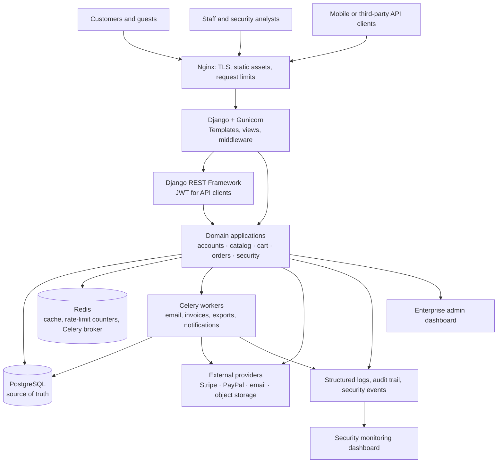

# Phase 1 — Project Planning & Architecture

## 1. Architecture decision

Build the platform as a **modular Django monolith**. Django web applications,
the REST API, administration dashboards, and security monitoring live in one
deployable codebase with explicit app boundaries. Celery workers process slow
or retryable work, while PostgreSQL remains the system of record.

This meets the requested enterprise requirements without prematurely introducing
microservices, a separate API gateway, or duplicated data stores. Those can be
split out later only when operational evidence requires it.

### Core principles

- **Secure by default:** Django's ORM, CSRF middleware, secure cookie settings,
  permission checks, audit events, and allow-listed file handling form the
  baseline. The vulnerability module demonstrates protections; it never
  contains exploit payloads or intentionally unsafe endpoints.
- **Clear ownership:** Each business capability is owned by one Django app.
  Cross-app workflows are orchestrated by services, not copied into views or
  signals.
- **Server-rendered first:** Customer and staff pages use Django templates with
  progressive JavaScript enhancements. The same services power DRF endpoints,
  avoiding a duplicated business layer.
- **Async only where useful:** email, invoice generation, notifications, exports,
  image processing, and scheduled reports run in Celery. Checkout, stock
  reservation, authorization, and permission checks remain synchronous and
  transactional.
- **Replaceable integrations:** Payment, email, storage, and delivery providers
  are isolated behind small service interfaces. A real provider is configured
  through environment variables; no credentials are stored in source control.

## 2. System architecture



### Request and data flow

1. Nginx terminates TLS, serves versioned static files, applies a conservative
   request-size limit, and forwards dynamic requests to Gunicorn.
2. Django middleware applies security headers, request IDs, session protection,
   authentication, authorization, and rate limits before a view runs.
3. Views or DRF viewsets validate input through forms/serializers and call an
   application service. Views never perform payment or order state transitions
   themselves.
4. Services use atomic PostgreSQL transactions for inventory, payment, and
   order changes. They emit audit and domain events after successful changes.
5. Celery handles non-blocking follow-up work. Retries are idempotent and use a
   task key so a provider webhook or retry cannot create duplicate orders,
   charges, invoices, or notifications.

## 3. Django application architecture

| App | Owns | Key collaborators |
| --- | --- | --- |
| `core` | configuration helpers, shared base models, health checks, common template tags | all apps |
| `accounts` | custom user, profile, addresses, authentication, MFA, roles, login history | `security`, `notifications` |
| `categories` | category tree and catalog navigation | `products` |
| `products` | products, variants, media, attributes, inventory-facing catalog services | `categories`, `reviews`, `analytics` |
| `cart` | carts, cart items, saved-for-later state, pricing preview | `products`, `coupons`, `orders` |
| `wishlist` | user wishlists and recently-viewed references | `products` |
| `coupons` | coupon eligibility, discounts, redemption records | `cart`, `orders` |
| `orders` | order lifecycle, order items, fulfillment, returns, refunds, invoices | `payments`, `products`, `notifications` |
| `payments` | provider adapters, payment attempts, webhook verification, payment state | `orders`, `security` |
| `reviews` | verified purchase reviews, ratings, moderation | `products`, `orders` |
| `notifications` | in-app, email, and push notification preferences and delivery tasks | `accounts`, all event-producing apps |
| `support` | customer tickets, staff responses, attachments | `accounts`, `orders`, `security` |
| `analytics` | read-only reporting queries, scheduled aggregates, export jobs | `orders`, `products`, `security` |
| `security` | audit logs, security events, login attempts, IP/risk controls, monitoring UI | `accounts`, all protected actions |
| `vulnerability_testing` | safe control checks, findings, recommendations, protection verification UI | `security`, `core` |
| `blog` | editorial posts, SEO metadata, publication workflow | `accounts` |
| `admin_dashboard` | staff-only operational dashboard and management views | domain apps, `analytics`, `security` |
| `api` | DRF routers, serializers, versioning, API permissions and schema | application services only |

### Boundary rules

- Models may reference another app's public model, but only the owning app
  mutates its own aggregate state.
- Views, API viewsets, tasks, management commands, and webhooks call services.
  Services hold business workflows and transactions.
- Signals are limited to local, non-critical side effects. Payment, inventory,
  and order state changes use explicit services so execution is traceable.
- `api` adapts HTTP to existing services; it does not reproduce domain logic.
- Dashboard and reporting code reads through reporting services and never
  bypasses staff authorization.

## 4. Roles and authorization model

Authorization uses Django groups plus fine-grained permissions. Object-level
checks are enforced in services for resources such as orders, reviews, tickets,
and addresses. Staff accounts require MFA before they can access staff routes.

| Role | Main capabilities | Explicit limits |
| --- | --- | --- |
| Guest | browse catalog, search, manage anonymous cart, guest checkout | cannot see account, order, or staff data |
| Customer | manage own profile, addresses, cart, orders, reviews, tickets | cannot access another customer's data or staff routes |
| Support agent | view assigned tickets and necessary order context; respond to customers | cannot issue refunds, modify products, or access security settings |
| Catalog manager | manage products, categories, media, inventory, and reviews | cannot access payments or security events |
| Order manager | manage fulfillment, returns, refunds within policy, and invoices | cannot manage staff accounts or platform configuration |
| Marketing manager | manage coupons, campaigns, newsletters, and blog content | cannot view payment details or security events |
| Analyst | view aggregated sales, inventory, traffic, and approved exports | no operational mutations or personal-data export by default |
| Security analyst | review security events, audit logs, vulnerability reports, and IP controls | no catalog/order changes unless separately assigned |
| Administrator | manage staff roles and all operational modules | sensitive settings, exports, and privilege changes are audited |
| Superuser | recovery-only Django superuser account | not used for everyday operations; MFA and audited break-glass procedure required |

## 5. Planned project layout

```text
secure-commerce/
├── manage.py
├── pyproject.toml
├── README.md
├── .env.example
├── config/
│   ├── settings/                 # base, development, production, test
│   ├── urls.py
│   ├── asgi.py
│   ├── wsgi.py
│   ├── celery.py
│   └── logging.py
├── apps/
│   ├── core/
│   ├── accounts/
│   ├── categories/
│   ├── products/
│   ├── cart/
│   ├── wishlist/
│   ├── coupons/
│   ├── orders/
│   ├── payments/
│   ├── reviews/
│   ├── notifications/
│   ├── support/
│   ├── analytics/
│   ├── security/
│   ├── vulnerability_testing/
│   ├── blog/
│   ├── admin_dashboard/
│   └── api/
├── templates/                    # shared base, email, and error templates
├── static/                       # source CSS, JavaScript, images
├── media/                        # local development uploads only; ignored by Git
├── tests/                        # cross-app integration and end-to-end tests
├── docs/
│   ├── architecture/
│   ├── api/
│   ├── operations/
│   ├── security/
│   └── testing/
├── infra/
│   ├── docker/
│   ├── nginx/
│   └── scripts/
└── compose.yaml
```

Each app follows the same small internal layout as needed:

```text
apps/products/
├── migrations/
├── templates/products/
├── static/products/
├── admin.py
├── apps.py
├── forms.py
├── models.py
├── selectors.py      # reusable read queries
├── services.py       # state-changing business workflows
├── tasks.py          # Celery entry points, when needed
├── urls.py
├── views.py
└── tests/
```

Files such as `serializers.py`, `permissions.py`, `middleware.py`,
`decorators.py`, management commands, and template tags are added only to the
apps that own that concern. Creating empty copies in every app would add
maintenance without behaviour.

## 6. Interface surfaces

| Surface | Audience | Delivery approach |
| --- | --- | --- |
| Customer storefront | guests and customers | responsive Django templates, accessible components, small progressive enhancements |
| Customer account | authenticated customers | account-owned views with object-level authorization |
| Operations dashboard | assigned staff | staff-only templates, role-aware navigation, chart data supplied by analytics services |
| Security dashboard | security analysts and administrators | immutable event views, filters, risk summaries, audited response actions |
| Safe security demonstration | staff, assessors, and academic reviewers | non-exploiting control verification and recommendations |
| REST API `/api/v1/` | first-party apps and approved integrations | DRF, versioned endpoints, JWT for API clients, throttling, schema documentation |

## 7. Security and operations baseline

The following decisions are fixed now and implemented in their named phases:

- Custom user model is created before the first migration; email is the
  login identifier.
- Sessions use `HttpOnly`, `Secure`, and `SameSite` cookies in production.
  Browser authentication uses CSRF-protected sessions; JWT is reserved for API
  clients and uses rotation/revocation controls.
- Sensitive values come from environment variables or the deployment secret
  store. `.env.example` contains placeholders only.
- Payment provider webhooks are signature-verified and idempotent. Card data is
  never stored by the platform.
- File uploads have allow-listed types, content checks, size limits, generated
  names, isolated media storage, and authorization checks before download.
- Audit records append actor, action, target, request ID, IP metadata, and
  timestamp. Security events are retained separately from application logs.
- Production settings require HTTPS, HSTS, CSP, secure headers, host validation,
  structured logging, health checks, and a database backup/restore procedure.
- PostgreSQL is authoritative. Redis is disposable cache/queue state; a cache
  miss must never change the correctness of an order or payment.

## 8. Delivery sequence and Phase 1 exit criteria

The requested phases will be executed in order. Phase 2 will establish the
custom user model and the relational model map before any other app migrations
are created. Later phases build on those stable boundaries rather than changing
core data ownership ad hoc.

Phase 1 is complete when the following are approved:

- modular-monolith deployment and infrastructure boundaries;
- ownership of every requested Django capability;
- roles and least-privilege access model;
- planned project layout and service-boundary rules;
- architecture diagram and secure request/data flow.

### Decisions needed before Phase 2

Unless you specify otherwise, Phase 2 will use these safe defaults:

1. Single initial storefront currency: USD, with money stored as decimal values
   and currency codes so multi-currency can be added without a model rewrite.
2. Stripe and PayPal sandbox adapters, with no live credentials in development.
3. PostgreSQL 16, Redis 7, and local file storage in development; S3-compatible
   object storage in production.
4. Email/password authentication plus an MFA extension point; Google social
   sign-in remains optional until provider credentials are available.

## Phase 1 implementation note

No executable Django code is created in this phase. This document is the
approved blueprint for the model work in Phase 2; creating empty apps or
placeholder models now would make the repository look complete without adding
working behaviour.
