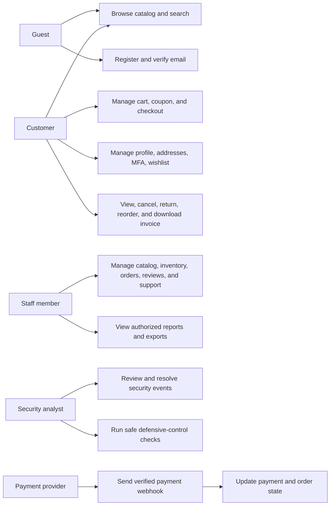
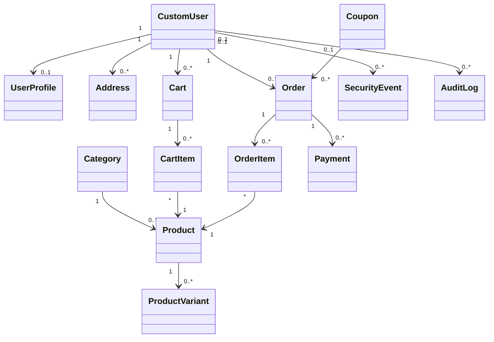
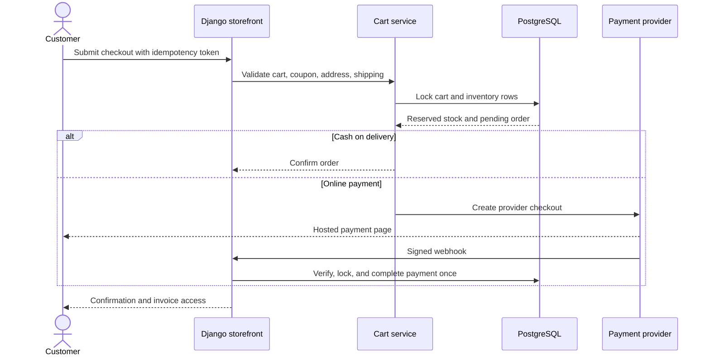
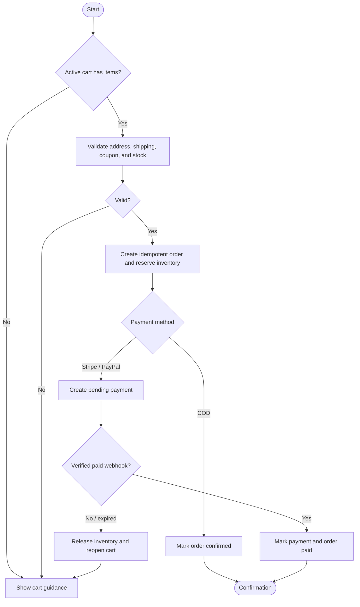
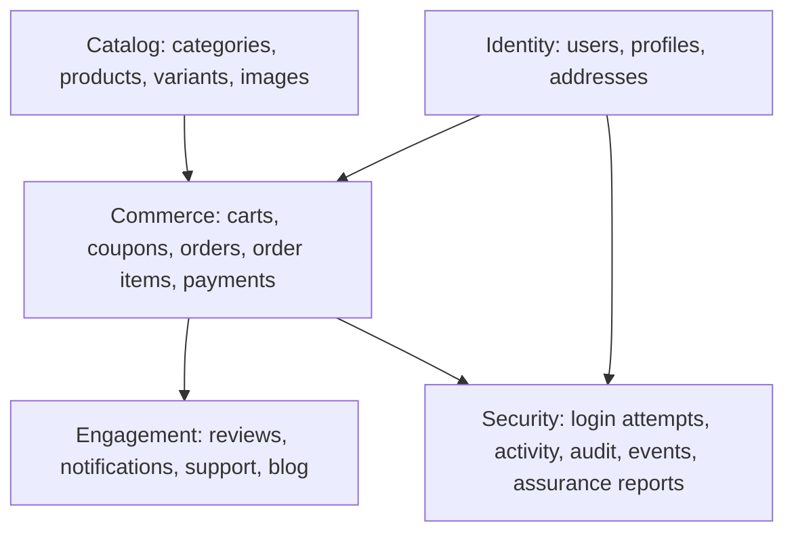
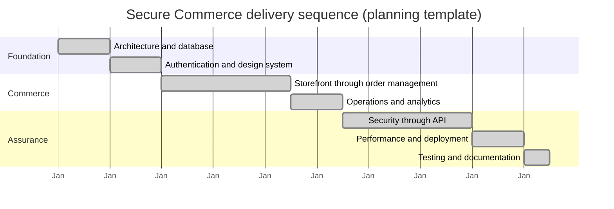

# Phase 18 — Academic Diagrams

These diagrams describe the implemented modular Django monolith. Mermaid-capable
Markdown renderers can display them directly. The Gantt view is a delivery
sequence template, not a record of elapsed project time.

## Use-case diagram

## Representative class diagram

The full database relationship map is the [Phase 2 ER diagram](phase-2-database-design.md#entity-relationship-diagram).

## Checkout sequence diagram

## Checkout activity diagram

## Database ownership diagram

## Gantt-style delivery sequence

